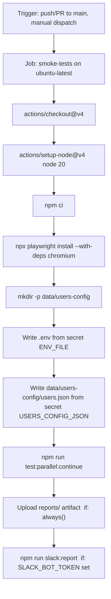

# GitHub Actions CI/CD for OptiKPI Smoke Tests

## Problem

The existing workflow at [`.github/workflows/playwright.yml`](.github/workflows/playwright.yml) is broken in three ways:
- Runs `npx playwright test` — the wrong runner (this project uses Cucumber.js via `npm run test:parallel`)
- Uses `npx playwright install --with-deps` (all browsers) instead of chromium-only
- Uploads `playwright-report/` (wrong path) — actual reports are in `reports/extent/`
- No `HEADLESS`, `PARALLEL_THREADS`, or user credentials setup
- Outdated comment about `@TestPreparation` — that tag no longer exists on any scenario

## Current Parallel Runner State

The runner (`config/parallel-run-config.json`) now has:

```json
{
    "failFast": false,
    "parallel": 4,
    "baseTag": "@SmokeTest or @Regression",
    "prerequisites": [
        { "tag": "@ExistingAudience", "name": "Existing Audience Setup" }
    ]
}
```

Actual execution flow confirmed by dry-run:

```
Phase 1: @ExistingAudience  (serial, 1 worker)
         → TC-AUD-REG-08 runs alone, publishes audience, writes names.json

Phase 2: (@SmokeTest or @Regression) and not @ExistingAudience  (parallel=4)
         → All remaining scenarios run 4 at a time
```

## Workflow Design



## Triggers

- `push` to `main` / `master`
- `pull_request` to `main` / `master`
- `workflow_dispatch` (manual trigger from GitHub UI)
- `schedule` nightly cron — included but commented out, ready to enable

## Secrets Required

All gitignored files/values the CI must recreate from GitHub repository secrets:

- `ENV_FILE` — full contents of the `.env` file (app base URL, etc.) → written to `.env`
- `USERS_CONFIG_JSON` — contents of `data/users-config/users.json` (test credentials) → written to that path
- `SLACK_BOT_TOKEN` — (optional) for Slack notifications
- `SLACK_CHANNEL_ID` — (optional) Slack channel to post results to

## Key Environment Variables

- `HEADLESS=true` — required (no display server on ubuntu-latest)
- `PARALLEL_THREADS=4` — matches `config/parallel-run-config.json`
- `CI=true` — standard flag
- `TZ=Asia/Kolkata` — matches Docker timezone for consistent report timestamps

## Test Command

`npm run test:parallel:continue` — uses `--continue-on-fail` so:
- `@ExistingAudience` runs first (serial)
- All remaining scenarios run in parallel (4 workers)
- A failure in Phase 1 does NOT abort Phase 2 — all results are still reported

## Artifacts

Upload the entire `reports/` directory with `if: always()` — this ensures reports are always available even when tests fail. Retention: 14 days.

Contents:
- `reports/extent/OptiKPI_V2.0_Smoke_Test.html` — combined Extent HTML report
- `reports/screenshots/` — failure screenshots
- `reports/run-summary.json` — used by Slack script

## Slack Step

Conditional — only runs if `SLACK_BOT_TOKEN` is set as a repository secret. Calls `npm run slack:report`.

## File to Change

- **Rewrite**: [`.github/workflows/playwright.yml`](.github/workflows/playwright.yml) — single file, full replacement
